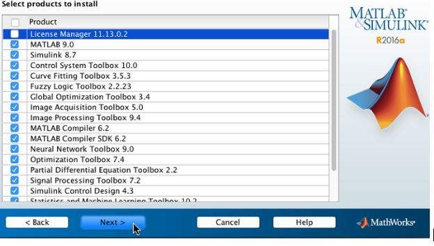
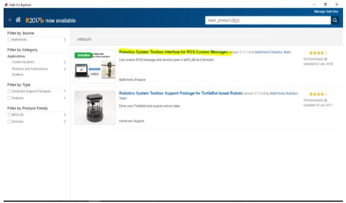
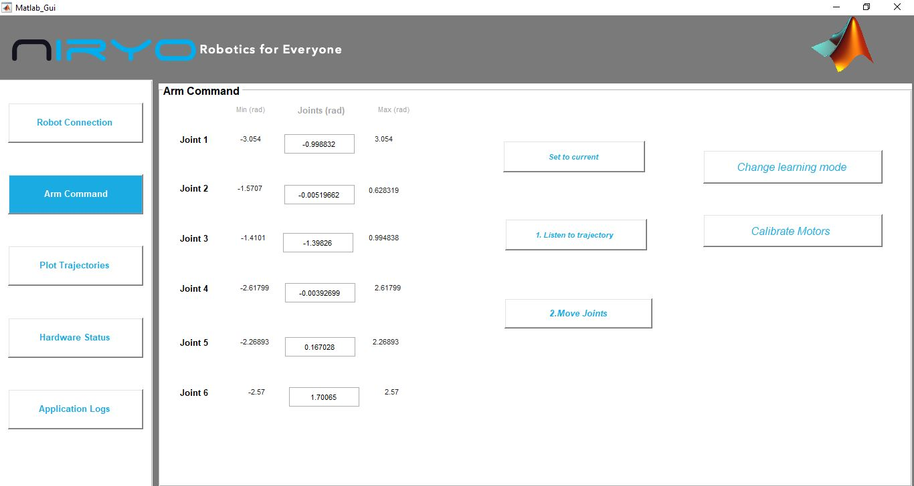
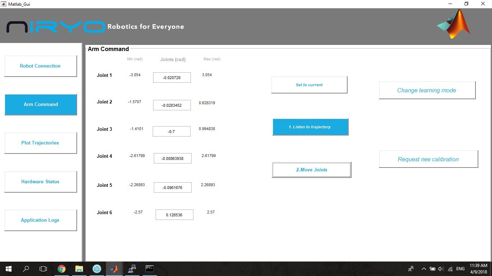
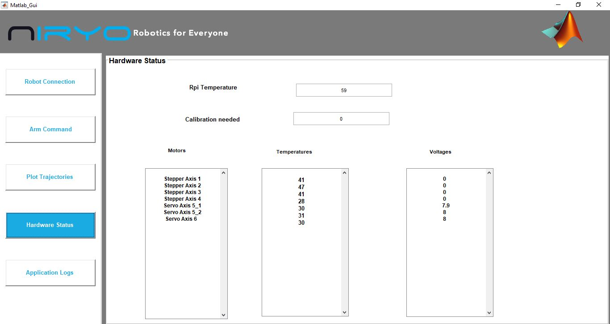
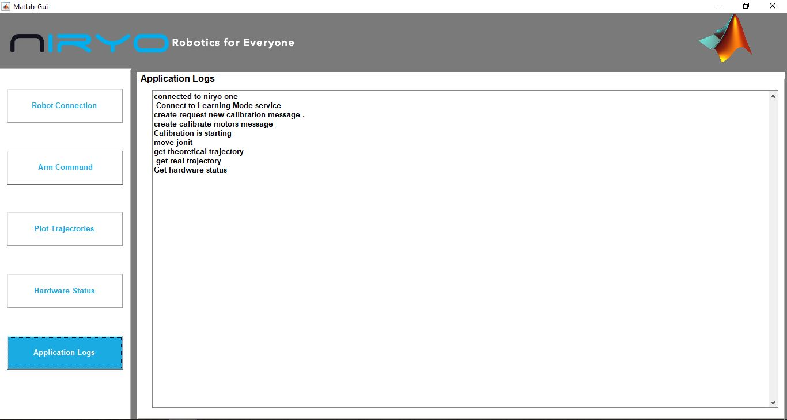

# **Niryo One - MATLAB interface**

This repository has MATLAB code and functions to execute Niryo One - MATLAB interface.

This interface connects Niryo-one to MATLAB to analyze differences between planned trajectory and executed trajectory.

In this application, we can compare  between the 2 differnet trajectories by ploting them as shown below.


this project connect to[ niryo one ros](https://github.com/NiryoRobotics/niryo_one_ros)
## list of Niryo One -MATLAB inetface functionality :  
-	Activate/ Disactivate learning Mode. 
-	Calibrate Motors .
-	Request New Calibration.
-	Send command to Niryo one.  
-	Plot planned and executed trajectory. 
-	Plot differences between planned trajectory and executed trajectory.
-	Export/import Data. 
-	Get Hardware Status parameters.
-	Display logs applications. 

#### 1.Install and Configure MATLAB-Ros Environment
##### 1.1 Install MATLAB
MATLAB has several versions, If you dont have MATLAB installation file, try to get the newer version.The installer can be downloaded from here:  [MatlabDownload]( https://fr.mathworks.com/ ).
*N.B. MathWorks provides the licensed product, a trial version and a student version.*


Install MATLAB in your  PC and make sure to select robotic toolbox while installation.



After finishing the installation , launch **MATLAB Command window**and  make sure that  the Robotic toolbox is installed by running :  

>  rosinit

##### 1.2 Set up MATLAB environment 
###### 1.2.1  Install robotics System Toolbox 
To install [Robotics System Toolbox](ttps://fr.mathworks.com/help/robotics/ug/install-robotics-system-toolbox-support-packages.html), Run this command in **MATLAB** command window:

 
>roboticsAddons
  



Then Choose Robotics System Toolbox Interface for ROS Custom Messages and click install. 

*N.B. If you have  MATLAB R2017a and earlier versions, you have to follow this [Bug Reports](https://fr.mathworks.com/login?uri=https%3A%2F%2Ffr.mathworks.com%2Fsupport%2Fbugreports%2F1741173%3Fnocookie%3Dtrue%26requestedDomain%3Dtrue)*

###### 1.2.1 Create Custom Messages from ROS Package 
You can follow this [tutorial](https://fr.mathworks.com/help/robotics/ug/create-custom-messages-from-ros-package.html).

 **In windows** , clone [niryo one ros](https://github.com/NiryoRobotics/niryo_one_ros.git) and note the folderpath

**In Ubnutu**, If you already install Niryo One ROS packages on your computer, you just have to note the folder path.
In **MATLAB** command window run:


>folderpath = your_folder_path

>rosgenmsg(folderpath)


Follow steps 1 to 3 from the output of rosgenmsg: 
- Edit javaclasspath.txt, add the following file locations as new lines, and save the file:
```
<your_folder_path>\jar\dynamixel_sdk-3.4.7.jar
<your_folder_path>\matlab_gen\jar\mcp_can_rpi-1.0.0.jar
<your_folder_path>\jar\niryo_one-1.1.0.jar
[...]
<your_folder_path>\matlab_gen\jar\niryo_one_rpi-1.1.0.jar
<your_folder_path>\matlab_gen\jar\niryo_one_tools-1.1.0.jar
<your_folder_path>\matlab_gen\jar\niryo_one_user_interface-1.1.0.jar
```
- Add the custom message folder to the MATLAB path by executing:

> addpath('your_folder_path')

>savepath

- Restart MATLAB and verify that you can use the custom messages. Type 

>rosmsg list

 Ensure that the output contains the generated custom message types.
```
niryo_one_msgs/CloseGripperRequest
niryo_one_msgs/CloseGripperResponse
niryo_one_msgs/DigitalIOState
niryo_one_msgs/GetDigitalIORequest
niryo_one_msgs/GetDigitalIOResponse
niryo_one_msgs/GetIntRequest
niryo_one_msgs/GetIntResponse
niryo_one_msgs/GetSequenceListRequest
niryo_one_msgs/GetSequenceListResponse
niryo_one_msgs/HardwareStatus
niryo_one_msgs/JoystickJointsAction
...........................
```

###### 1.2.3 Connect ROS-MATLAB to ROS robot as a master
- Find the name of your hostname 
**In windows**, open cmd window and type hostname e.g. WINDOWSPC) 
**In Raspberry Pi**, type  hostname -I (e.g. ROBOTPC) 

-Look for IP_ address of robot and matlab computer, they should had the same mask 255.255.255.0
e.g. 
```
192.168.65.82 %  <ROBOTIP>
192.168.65.80 % <WINDOWSPCIP>
```
- Edit file C:\Windows\system32\drivers\etc\hosts **in windows**  and  /etc/hosts ** in Raspberry Pi** by adding those two lines : 

``` 
192.168.65.82	 <ROBOTPC>
192.168.65.80	<WINDOWSPC>
```

Restart your computer 

-  Turn off all the firewalls on Mtalab PC and Ubuntu PC

- Set environment variables on your robot 
 
``` 
  export ROS_MASTER_URI=http://<ROBOTIP>:11311
  export ROS_IP=  <ROBOTIP>
  ``` 
 Restart your robot 

-  try to ping both windows pc and the robot
For more information:[RosNetworkSetup] (http://wiki.ros.org/ROS/NetworkSetup)
on **matlab window** command
  
> !ping ROBOTIP

 ```
Pinging <ROBOTIP> with 32 bytes of data: 
Reply from <ROBOTIP>: bytes=32 time=6ms TTL=64 
Reply from <ROBOTIP>: bytes=32 time=4ms TTL=64 
Reply from <ROBOTIP>: bytes=32 time=4ms TTL=64 
Reply from<ROBOTIP>: bytes=32 time=4ms TTL=64 
 ```
- On MATLAB command window , set the environment variables for ROS:

>setenv('ROS_MASTER_URI','ROBOTIP:11311')

>setenv('ROS_IP','WINDOWSPCIP')

>rosinit


*N.B. the last step is not necessary , cause it s already in matlab code*

### 2.Download the application 
First download or clone the application file form [here] ( )
### 3.Getting started with the application 
- For your first connection : 
open niryo One Studio and follow the steps to connect Niryo one to the wifi network in order to connect your computer and your robot to the same network.
- Open Matlab_Gui file
- Click run 


 This will bring up the start  screen


- Put your <ROBOTIP> in the first text box( its the same ip address you used to configure connection between robot and matlab-ros). 

- Put your <ROBOTIP> in the first text box( its the same ip address you used to configure connection between robot and matlab-ros). 
Put your <WINDOWSPCIP>  in the second text file ( the same you used in section 2.1.3) 
Click connect to Niryo one button to connect Matlab  to your robot . wait few seconds until the connection is established. 
When the button turned to connected you can start commanding your robot. 
- Go to arm Command button 



You can use Learning Mode button to activate /disactivate learning mode 
You can use calibrate Motors button to start calibrating motors.

 - You can send command to your robot: Enter joints value and click Move joints ,you must see you robot move to the following command.



- In order to compare the planned and the executed trajectory ,enter joints value, press listen to trajectory button first, and then press Move joints button.
The application  will work for a few second before presenting you the results of trajectories on plot trajectory window.
Choose the joint ( form joint 1 to joint 6) you want to plot and you will see a curve graph of the planned ,the real trajectory and the difference between them.

![plot trajectory] (./screenshot/plot.JPG)

- If you want to export result, click export button , choose a location and a name of your text file. the trajectory will be saved in both a text and an excel file.

![export] (./screenshot/export.JPG)

-  You can import a saved trajectory data by clicking on import button and choosing an excel file.
-  Click Hardware Status button to get updated hardware status.



-   Click application logs button to see your history activities. 



##### **If you find problems and need any help, please do not hesitate to contact us at support@niryo.com .**
**Thank you !**

